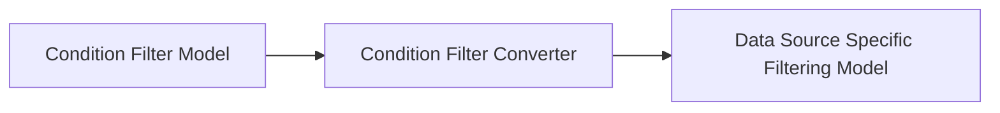

# Attribute Conditions

The Attribute Condition type leverages the concept of [Attributes](../../../concepts/attributes/index.md) to create a generic model representing the comparison of an Attribute's value to some other static value. Attribute Conditions can be composed using the Logic Condition in order to group several sets of Attribute Conditions in AND and OR clauses.

The basic anatomy of the Attribute Condition is as follows:
```javascript
{
  type : TYPE,
  attrName : opts.attrName || null,
  comparator : null
}
```
where attrName is the unique name of the attribute and comparator is a Comparator model. A Comparator is a brief encapsulation of logic, such as "equals 5" or "greater than 10" or "contains 'happy'". Put together, these concepts allow us to construct logic such as "Height is greater than 62 inches", "Name contains Jen" or "Position is within 5 miles of -80 lat, 110 lon".

There are many comparator types included in the `@leverege/ui-attributes` library and installed by default in Molten. These comparators are installed using a NameValueView, meaning that in order to determine which comparators are available for a given attribute, first the editor will look to see if any comparators are registered against the specific and unique name of the Attribute being edited, then fall back to see if any comparators are registered that can handle that Attribute's valueType.

Built in comparators are all registered using valueType, so by default any attribute which has been declared with a valueType of "string" will have access to all of the built in comparator types appropriate for strings (such as equals, starts with, ends with, contains, etc.). Allowing registration by name though allows the ability to override the valueType comparators for a given attribute. Perhaps in a particular case you have defined a custom Attribute on the UI side which is a roll-up of various other Attributes but has no direct equivalent data field on the server side. A great example of this are "Alerts" which are often based on complex logic such as "has moved since last position report and is low on battery". For such an Attribute, it would be possible to register a cusom comparator which could generate a complex filter for each alert state but present a simple UI which uses alert "names" to represent each complex filter.

## Generating a Data Source Specific Filter Model
It was mentioned in the [introduction to this section](./index.md) that the high level concept of filtering in Molten can be seen as follows:



Here we see no mention of comparators. How then do comparators work to generate a Data Source Specific Filtering Model? The answer is that the Condition Filter Converters for Imagine group data delegate the responsibility of generating a Data Source Specific Filtering Model to their children. In the case of the Logic ConditionFilterConverter, the work of generating filters for its child Attribute Conditions is delegated to the registered ConditionFilterConverters of those child Attribute Conditions. The Attribute ConditionFilterConverter in turn delegates its filter creation to its child comparator's ComparatorFilterConverter. This is all possible through the use of Molten's ConditionFilterConverterFactory and ComparatorFilterConverterFactory which are factories capable of creating all of all of the converters that have been registered. Let's take a look at a brief example:

```javascript
import ConditionFilterModel from '../../../filters/filter/ConditionFilterModel'
import ConditionFilterConverterFactory from '../../../filters/filter/ConditionFilterConverterFactory'
import Util from '../../../filters/filter/Util'

export default {
  type : 'groupDelegate.imagine.condition.Filter.ConditionFilterConverter',
  convert : ( type, conditionModel, context ) => {
    const { clientProps : { actions } } = context
    const rootCondition = ConditionFilterModel.getRootCondition( conditionModel )
    
    return ConditionFilterConverterFactory.create(
      Util.getFilterConverterTypeForType( actions.type, rootCondition.type ),
      rootCondition,
      context
    )
  }
}
```
Here the ConditionFilterConverter takes the rootCondition from the ConditionFilter and checks the ConditionFilterConverterFactory to see if it has a ConditionFilterConverter for the rootCondition (in this case, a LogicCondition). Don't worry about the call to `Util.getFilterConverterTypeForType`. It is simply a convenience function for appending the condition's type to the delegate's type for lookup in the factory.

Next, the Logic Condition's ConditionFilterConverter constructs a small part of the resulting filter and delegates what it does not know about back to the factory:

```javascript
import ConditionFilterConverterFactory from '../../../filters/filter/ConditionFilterConverterFactory'
import Util from '../../../filters/filter/Util'

export default {
  type : 'groupDelegate.imagine.condition.Logical.ConditionFilterConverter',
  convert : ( type, condition, context ) => {
    const { clientProps : { actions } } = context

    const conditions = condition.conditions
      .map( c => ConditionFilterConverterFactory.create(
        Util.getFilterConverterTypeForType( actions.type, c.type ),
        c,
        context
      ) )
      .filter( c => c != null )

    if ( conditions.length === 0 ) {
      return null
    }

    return {
      type : 'logical',
      conditions,
      operator : condition.operator
    }
  }
}
```
The Attribute ConditionFilterConverter delegates the creation of its part of the final filter model to a ComparatorFilterConverter, passing itself so as to give the comparator converter the context it needs to build a filter for its parent AttributeCondition:
```javascript
import { Attributes } from '@leverege/ui-attributes'
import ComparatorFilterConverterFactory from '../../../filters/filter/comparator/ComparatorFilterConverterFactory'
import Util from '../../../filters/filter/comparator/Util'

export default {
  type : 'groupDelegate.imagine.condition.Attribute.ConditionFilterConverter',
  convert : ( type, condition, context ) => {
    const { attrName } = condition
    const { objectType, clientProps } = context
    const { actions } = clientProps

    const attribute = Attributes.getAttribute( attrName, objectType )

    if ( !condition?.comparator ) {
      return null
    }

    return ComparatorFilterConverterFactory.create(
      Util.getComparatorConverterTypeForType( actions.type, condition.comparator.type ),
      condition.comparator,
      attribute
    )
  }
}
```
And finally, a compartor converter handles the creation of a single part of the overall filter. For instance, the StringEqualsComparatorFilterConverter works like this:
```javascript
export default {
  id : 'molten.string.Equals.ComparatorFilterConverter',
  type : 'groupDelegate.imagine.string.Equals.ComparatorFilterConverter',
  convert : ( type, cmp, attribute ) => {
    if ( cmp?.value1 == null ) {
      return null
    }
    
    return {
      type : 'equals',
      value : cmp.value1,
      field : attribute.blueprint.field
    }
  }
}
```

Now that we have a better understanding of how AttributeConditions work to create Data Source Specific Filtering Models, we'll take a look at how one would add a custom Comparator for a custom Attribute.