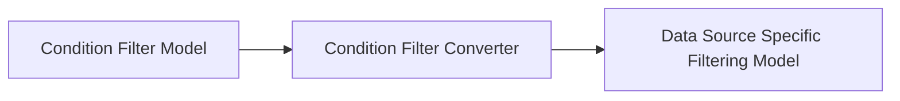

# Filtering

At a high level, the concept of filtering in Molten can be seen as follows:

In its simplest form, the Condition Filter Model can be exactly the same as the Data Source Specific Filtering Model and the Condition Filter Converter can simply return the original model rather than doing any translation. However, separating the two models allows us to reuse the same Condition Filter Model and its editor in multiple places in Molten where similar logic is needed. For instance, the same Condition Model with a different Condition Filter Converter can be used to edit filters for querying sets of data, to edit where clauses for querying historical data or for conditional colorization of a table cell.

Filtering in Molten is tied closely to the concept of [Data Sources](../../data-sources/index.md). For each data source that is introduced in molten, a corresponding set of delegates (for group data and item data) must also be configured to provide an interface for interacting with the data source (creating, reading, updating, deleting, etc.). Each delegate has a `type` property, and for each `type` of delegate, a Condition Filter Model and Condition Filter Model Editor must be registered in order to support filtering. A Condition Filter Converter must also be registered. Each time filters are applied by a user using the Condition Filter Model Editor, the registered Condition Filter Converter will be called and the resulting Data Source Specific Filtering Model will be passed in the options to the search method of the delegate as the `filter` property. The delegate can then use that object, specific to its querying capabilities, to query for data.

For further information on filtering custom data, see the [Custom Data](./custom-data.md) section.