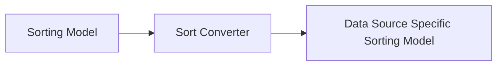

# Sorting

Sorting in Molten follows a very similar model to filtering and can be seen as follows:



The sorting model is simply an ordered list of data fields, specified by attribute name, a sort direction (either ascending or descending) and a missing flag (either first or last) to indicate if missing values should be sorted to the top or bottom of a data list.

To leverage Molten's built in sorting capabilities for a custom data type, simply register the default SortModel provided by molten as the model for your delegate type:

```javascript
molten.addPlugin( 'SortModel', { type : PetsAction.TYPE, model : AttributeSortModel } )
```
Where PetsAction is your group data delegate class and TYPE is its unique type key.

This will provide the default Molten sort editor as your sorting UI.

In addition, you'll need to register an AttributeSortConverter plugin which will take an instance of the SortModel and translate it into an object or other representation that makes sense to your group data delegate and backend data store:

```javascript
/* PluginSetup.js */
molten.addPlugin( 'AttributeSortConverter', PetsAttributeSortConverter )
/* PetsAttributeSortConverter.js */
import { Attributes } from '@leverege/ui-attributes'

import AttributeSortModel from '../../../filters/sort/AttributeSortModel'

export default {
  type : 'groupDelegate.pets.AttributeSortConverter',
  convert : ( type, sortModel, context ) => {
    const { objectType } = context
    const fields = AttributeSortModel.getFields( sortModel )
    
    const sort = fields.map( ( field ) => {
      const attribute = Attributes.getAttribute( field.attrName, objectType )

      if ( !attribute ) {
        return null
      }

      return {
        field : attribute.blueprint?.field,
        missing : field.order === 'asc' ? '_first' : '_last',
        order : field.order
      }
    } )
      .filter( field => field != null )

    if ( sort.length > 0 ) {
      return sort
    }

    return null
  }
}
```

## Customized Sorting

If you require further customization of your SortModel, you can simply register a different model for your delegate with the SortModel plugin point and provide an editor to the ModelEditor plugin point.